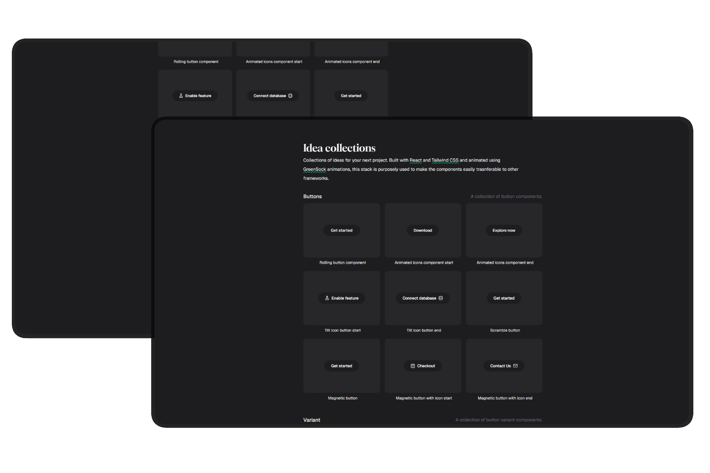

# Fourteen Studio Collection


A personal playground for UI components and micro-interactions, built before they go into other projects, currently an astro template and a ghost cms custom theme. GSAP is the only animation library used here intentionally, as it makes migrating to different framework formats more straightforward down the line.

> Work in progress, new things will be added as the upstream projects demand them.



---

## Getting started

**Prerequisites:** Node.js 18+

**1. Clone the repo**

```bash
git clone https://github.com/your-username/fourteen-ui.git
cd fourteen-ui
```

**2. Install dependencies**

```bash
npm install
```

**3. Start the dev server**

```bash
npm run dev
```

Open [http://localhost:5173](http://localhost:5173) to view it in the browser.

---

## What's next

Buttons are mostly done for now. The next focus is larger interactive components:

- **Dropdown menu** — animated open/close with staggered items
- **Slider** — drag-based with smooth momentum and bounds snapping
- **Lightbox** — image viewer with entrance/exit transitions

---

## License

MIT — see [LICENSE](./license) for details.
